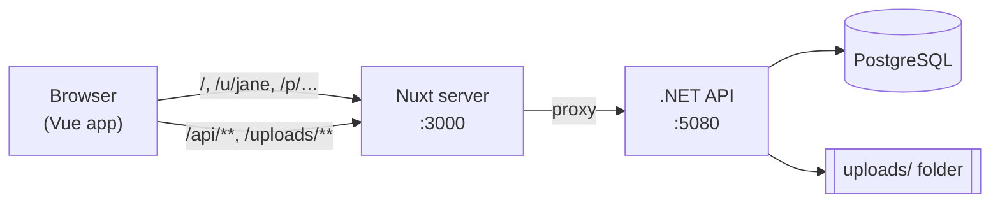
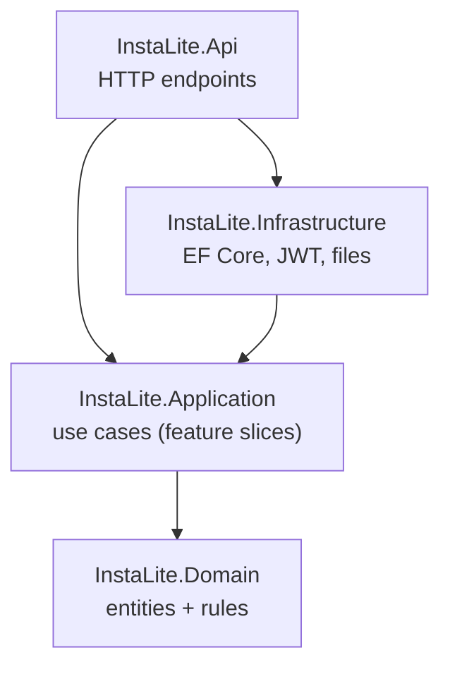
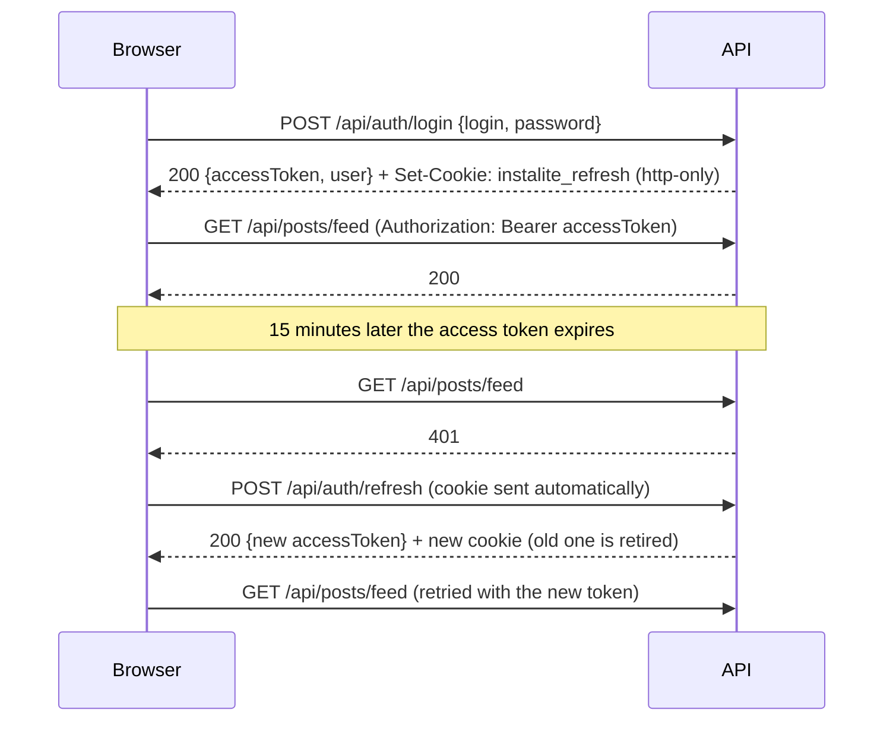

# InstaLite architecture guide

This guide explains how the code is organised and walks through adding a feature, so you can change the app with confidence.

- [The big picture](#the-big-picture)
- [Backend](#backend)
  - [Layers (Clean Architecture)](#layers-clean-architecture)
  - [Feature slices and CQRS](#feature-slices-and-cqrs)
  - [Following one request from start to end](#following-one-request-from-start-to-end)
  - [Errors](#errors)
  - [Authentication](#authentication)
  - [Database and migrations](#database-and-migrations)
  - [Pagination](#pagination)
- [Frontend](#frontend)
- [Recipe: add a new feature end to end](#recipe-add-a-new-feature-end-to-end)
- [API reference](#api-reference)
- [Troubleshooting](#troubleshooting)

---

## The big picture



The browser only talks to the Nuxt server. Nuxt forwards `/api/**` and `/uploads/**` to the .NET API (see `routeRules` in
`frontend/nuxt.config.ts`). Because everything comes from one origin, CORS is not involved and the http-only refresh cookie works.

---

## Backend

### Layers (Clean Architecture)



Arrows mean "depends on". The important rule is that **the inner layers know nothing about the outer ones**:

| Project | Contains | May use |
|---------|----------|---------|
| `Domain` | Entities (`User`, `Post`, `Story`…) and their rules, e.g. "a post has 1 to 10 images". | Nothing |
| `Application` | One file per use case (`Features/Posts/CreatePost.cs`), plus the interfaces it needs (`IAppDbContext`, `IFileStorage`, `ICurrentUser`…). | Domain, EF Core LINQ, FluentValidation |
| `Infrastructure` | Implementations of those interfaces: `AppDbContext` (PostgreSQL), `JwtTokenService`, `PasswordHasher`, `LocalFileStorage`, migrations, demo data. | Application, Domain |
| `Api` | Endpoints that turn HTTP into commands/queries and results into HTTP. `Program.cs` wires everything up. | Everything |

> **Pragmatic choice:** the Application layer uses EF Core's `DbSet<T>` through `IAppDbContext` instead of a repository per
> entity. Handlers write normal LINQ queries, and it is still easy to test because the database is behind an interface.

### Feature slices and CQRS

Every use case lives in **one file** under `backend/src/InstaLite.Application/Features/<Area>/`. Open the file and you see the whole feature:

```csharp
// Features/Likes/LikePost.cs

// 1. The input. A COMMAND changes data; a QUERY only reads (CQRS).
public sealed record LikePostCommand(Guid PostId) : ICommand<LikeStatusDto>;

// 2. (optional) Validation rules for the input: see CreatePost.cs for an example.

// 3. The handler: the actual logic.
public sealed class LikePostHandler(IAppDbContext db, ICurrentUser currentUser, TimeProvider clock)
    : ICommandHandler<LikePostCommand, LikeStatusDto>
{
    public async Task<Result<LikeStatusDto>> Handle(LikePostCommand command, CancellationToken cancellationToken)
    {
        ...
        if (authorId is null) return PostErrors.NotFound;   // failure
        ...
        return new LikeStatusDto(IsLikedByMe: true, likeCount); // success
    }
}
```

How the pieces connect:

- `Common/Messaging/Cqrs.cs` defines `ICommand<T>`, `IQuery<T>`, `ICommandHandler<,>` and `IQueryHandler<,>`.
- `DependencyInjection.cs` finds every handler **automatically** and wraps it in a validation decorator
  (`Common/Messaging/ValidationDecorators.cs`). A handler therefore only runs when its FluentValidation rules pass.
  There's nothing to register by hand.
- Endpoints ask for a handler by interface: `ICommandHandler<LikePostCommand, LikeStatusDto> handler`.
  In your IDE, *Go to Implementation* jumps straight to the handler. No mediator library is involved.

Conventions:

| Kind | Naming | Example |
|------|--------|---------|
| Command (writes) | `<Verb><Thing>Command` + `<Verb><Thing>Handler` | `CreatePostCommand`, `CreatePostHandler` |
| Query (reads) | `Get<Thing>Query` + `Get<Thing>Handler` | `GetFeedQuery`, `GetFeedHandler` |
| Validator | `<Verb><Thing>Validator` | `CreatePostValidator` |
| Response | `<Thing>Dto` | `PostDto` |
| Errors of an area | `<Area>Errors` | `PostErrors.NotFound` |

Queries use `AsNoTracking()` and project straight into DTOs (`PostProjections.ToPostDto(viewerId)`), so only the
needed columns are loaded. Commands load entities, call their methods and `SaveChangesAsync()`.

### Following one request from start to end

What happens when someone taps ❤️ on a post:

1. **Frontend**: `PostActions.vue` → `usePostActions().toggleLike()` → `postsApi.like(id)` → `POST /api/posts/{id}/like`
2. **Nuxt** forwards the request to the API.
3. **API**: `Endpoints/PostEndpoints.cs` maps the route and asks for `ICommandHandler<LikePostCommand, LikeStatusDto>`.
4. The **validation decorator** runs any validators for `LikePostCommand`, then calls the handler.
5. **Handler** `Features/Likes/LikePost.cs`: checks that the post exists, adds a `Like` and a `Notification`, saves.
6. It returns a `Result<LikeStatusDto>`. `ResultExtensions.ToHttpResult()` turns it into `200 OK` + JSON,
   or into an error response (see below).

### Errors

- **Expected failures** (not found, not allowed, already taken…) are returned from handlers as `Error` values, never
  thrown. Each area keeps its errors together, e.g. `Features/Posts/PostErrors.cs`.
  `ErrorType` decides the HTTP status: Validation 400, Unauthorized 401, Forbidden 403, NotFound 404, Conflict 409.
- **Invalid input** is caught by FluentValidation and returned as 400 with one message per field:
  ```json
  { "status": 400, "detail": "One or more fields are invalid.", "errors": { "username": ["Username is required."] } }
  ```
- **Unexpected exceptions** are handled by `Api/Common/GlobalExceptionHandler.cs` (logged, 500 response).
  `DomainException` (a broken entity rule) becomes a 400.

The frontend shows `detail` (or the first field error) through `getErrorMessage()` in `frontend/app/utils/errors.ts`.

### Authentication



- **Access token**: a short-lived JWT, kept **in memory only** in the frontend (`stores/auth.ts`).
- **Refresh token**: random, long-lived, stored as an **http-only cookie** (JavaScript can't read it) and only as a
  **hash** in the database. Every refresh replaces it ("rotation"). The old one keeps working for 30 seconds so that several
  tabs opening at once don't log each other out (`RefreshToken.RotationGracePeriod`).
- Logout and password change **revoke** tokens immediately.
- Passwords are hashed with ASP.NET Core Identity's PBKDF2 hasher.
- Login, sign-up and password change are rate limited per IP address.
- The frontend's `api/client.ts` does the "401 → refresh → retry" dance for every request.

### Database and migrations

- Entity-to-table mapping: `Infrastructure/Persistence/Configurations/*.cs`. Tables and columns use `snake_case`
  (`post_images.post_id`).
- IDs are GUID v7 (time-ordered), created in the domain (`Entity.cs`).
- All times are UTC (`DateTime` with `timestamptz` columns). Handlers get the time from `TimeProvider`, so tests can
  control it.
- Deleting a user or post cascades to its likes, comments, notifications and so on.

After changing an entity or configuration, create a migration (from `backend/`):

```bash
dotnet tool restore        # once: installs the local "dotnet ef" tool
dotnet ef migrations add <DescriptiveName> --project src/InstaLite.Infrastructure --startup-project src/InstaLite.Api --output-dir Persistence/Migrations
```

In development the migration is applied automatically on the next start (`Database:ApplyMigrationsOnStartup`).
To apply manually: `dotnet ef database update --project src/InstaLite.Infrastructure --startup-project src/InstaLite.Api`.

### Pagination

Long lists (feed, comments, followers, notifications…) return a `CursorPage<T>`:

```json
{ "items": [ ... ], "nextCursor": "638950000000000000" }
```

Send `nextCursor` back as `?cursor=` to get the next page; `null` means there is nothing more. The cursor is opaque:
for date-ordered lists it is a timestamp ("older than this"), for explore/saved it is an offset. See `Common/Pagination/`.

---

## Frontend

The app is a single-page app (`ssr: false`) built with Nuxt. Nuxt conventions to know:

| Folder | What goes there | Notes |
|--------|-----------------|-------|
| `app/pages/` | One file per screen. The file path is the URL: `pages/u/[username]/index.vue` → `/u/jane` | |
| `app/layouts/` | `default.vue` (sidebar/bottom bar) and `auth.vue` (login screens) | Pages pick one with `definePageMeta({ layout })` |
| `app/components/` | UI pieces, grouped in folders by area | **Auto-imported** by file name: `<PostCard>` |
| `app/composables/` | Reusable logic (`useInfiniteList`, `usePostActions`...) | **Auto-imported** |
| `app/utils/` | Plain helper functions (`timeAgo`, `getErrorMessage`...) | **Auto-imported** |
| `app/stores/` | Pinia stores: `auth` (who is signed in), `notifications` (badge) | Imported explicitly |
| `app/api/` | Typed functions per backend area: `postsApi.like(id)` | Imported explicitly |
| `app/middleware/auth.global.ts` | Runs before every page: sends signed-out visitors to `/login` | Pages opt out with `definePageMeta({ public: true })` |

UI components come from [Nuxt UI](https://ui.nuxt.com) (`UButton`, `UModal`, `UCarousel`, `UForm`...). Colors are set in
`app/app.config.ts` and use theme tokens such as `text-muted` and `bg-elevated`, which adapt to light and dark mode automatically.

**Responsive design** uses Tailwind breakpoints (mobile first):

| Width | Layout |
|-------|--------|
| < 768px (phone) | `AppMobileHeader` on top, `AppBottomNav` at the bottom, full-width content |
| ≥ 768px (`md:`) | `AppSidebar` with icons only |
| ≥ 1280px (`xl:`) | `AppSidebar` with icons and labels; home page shows "Suggested for you" (`lg:` and up) |

**Common patterns:**

- *Infinite lists*: `const { items, loading, hasMore, loadMore } = useInfiniteList(cursor => postsApi.feed(cursor))`
  plus `<InfiniteScrollTrigger :loading :has-more @load="loadMore" />` at the end of the list.
- *Editing a post inside a list*: components take `v-model:post`, so a like inside `<PostCard>` updates the list item.
- *Optimistic updates*: the UI changes first and rolls back if the API call fails (`usePostActions.ts`, `FollowButton.vue`).
- *Forms*: `<UForm :schema="zodSchema" :state>` validates in the browser. Server field errors are shown with
  `form.setErrors(getFormErrors(error))` (see `register.vue`).
- *Global dialogs*: the create-post dialog and story viewer live once in `layouts/default.vue`; open them from anywhere
  with `useCreatePost().open()` or `useStoryViewer().open(...)`.

---

## Recipe: add a new feature end to end

Example: **let users pin a post to the top of their profile.**

### 1. Domain: add the data and the rule

`backend/src/InstaLite.Domain/Posts/Post.cs`

```csharp
public DateTime? PinnedAt { get; private set; }

public void Pin(DateTime now) => PinnedAt = now;
public void Unpin() => PinnedAt = null;
```

### 2. Database: create a migration

```bash
cd backend
dotnet ef migrations add AddPostPinning --project src/InstaLite.Infrastructure --startup-project src/InstaLite.Api --output-dir Persistence/Migrations
```

(Add an index in `PostConfiguration` if you will filter or sort by the new column.)

### 3. Application: add the use case

Create `backend/src/InstaLite.Application/Features/Posts/PinPost.cs`:

```csharp
using InstaLite.Application.Common.Abstractions;
using InstaLite.Application.Common.Messaging;
using InstaLite.Application.Common.Results;
using Microsoft.EntityFrameworkCore;

namespace InstaLite.Application.Features.Posts;

public sealed record PinPostCommand(Guid PostId) : ICommand<Unit>;

public sealed class PinPostHandler(IAppDbContext db, ICurrentUser currentUser, TimeProvider clock)
    : ICommandHandler<PinPostCommand, Unit>
{
    public async Task<Result<Unit>> Handle(PinPostCommand command, CancellationToken cancellationToken)
    {
        var post = await db.Posts.SingleOrDefaultAsync(p => p.Id == command.PostId, cancellationToken);
        if (post is null) return PostErrors.NotFound;
        if (!post.IsAuthoredBy(currentUser.Id)) return PostErrors.NotAuthor;

        post.Pin(clock.GetUtcNow().UtcDateTime);
        await db.SaveChangesAsync(cancellationToken);
        return Unit.Value;
    }
}
```

The handler is registered automatically. Then show pinned posts first in `GetUserPosts.cs`, e.g.
`.OrderByDescending(p => p.PinnedAt != null).ThenByDescending(p => p.CreatedAt)`, and add `bool IsPinned` to `PostDto`
and `PostProjections`.

### 4. API: add the endpoint

In `backend/src/InstaLite.Api/Endpoints/PostEndpoints.cs`:

```csharp
group.MapPost("/{postId:guid}/pin", async (
        Guid postId,
        ICommandHandler<PinPostCommand, Unit> handler,
        CancellationToken cancellationToken) =>
    (await handler.Handle(new PinPostCommand(postId), cancellationToken)).ToHttpResult());
```

Try it at http://localhost:5080/scalar.

### 5. Test it

Add a test to `backend/tests/InstaLite.Tests/Api/PostTests.cs` (copy an existing one: create users with
`factory.CreateUserAsync()`, then call the API with `user.Client`). Run `dotnet test`.

### 6. Frontend

1. `app/types/api.ts`: add `isPinned: boolean` to `Post`.
2. `app/api/posts.ts`: add `pin: (postId: string) => apiRequest<void>(`/api/posts/${postId}/pin`, { method: 'POST' })`.
3. `app/components/posts/PostMenu.vue`: add a "Pin to profile" item for the author that calls `postsApi.pin`.
4. `app/components/posts/PostGrid.vue`: show a pin icon when `post.isPinned`.
5. Run `npm run typecheck`.

---

## API reference

Interactive docs with every request/response shape: **http://localhost:5080/scalar** (development only).
Click *Authorize* and paste an access token to call protected endpoints.

| Method | Route | Purpose |
|--------|-------|---------|
| POST | `/api/auth/register` · `/login` · `/refresh` · `/logout` | Sign-up / sign-in / session |
| GET | `/api/auth/me` | The signed-in user |
| PUT | `/api/account/profile` · `/avatar` | Edit name & bio · upload profile photo |
| DELETE | `/api/account/avatar` | Remove profile photo |
| POST | `/api/account/change-password` | Change password |
| GET | `/api/users/search?q=` · `/suggestions` | Find people |
| GET | `/api/users/{username}` · `/posts` · `/stories` · `/followers` · `/following` | Profile data |
| POST/DELETE | `/api/users/{username}/follow` | Follow / unfollow |
| GET | `/api/posts/feed` · `/explore` · `/saved` | Post lists |
| POST | `/api/posts` (multipart: `caption`, `images`) | Create a post |
| GET/PATCH/DELETE | `/api/posts/{id}` | Read / edit caption / delete |
| POST/DELETE | `/api/posts/{id}/like` · `/save` | Like · save |
| GET | `/api/posts/{id}/likes` | Who liked |
| GET/POST | `/api/posts/{id}/comments` | Read / add comments |
| DELETE | `/api/comments/{id}` | Delete a comment |
| GET/POST | `/api/stories` (multipart: `image`) | Story bar / add a story |
| DELETE | `/api/stories/{id}` | Delete a story |
| POST | `/api/stories/{id}/view` | Mark as seen |
| GET | `/api/stories/{id}/viewers` | Who saw my story |
| GET | `/api/notifications` · `/unread-count` | Notifications |
| POST | `/api/notifications/mark-read` | Mark all as read |

---

## Troubleshooting

| Problem | Fix |
|---------|-----|
| API fails with "Connection refused" | PostgreSQL isn't running: `docker compose up -d` |
| `Jwt:SigningKey` validation error on start | Outside Development you must set `Jwt__SigningKey` (32+ characters) |
| Page is blank the first time in dev | Vite is still pre-bundling dependencies; wait a moment and reload |
| Logged out after restarting the API | Expected if the database was reset; otherwise check the signing key didn't change |
| `dotnet ef` not found | Run `dotnet tool restore` in `backend/` |
| Tests fail to start | Docker must be running (Testcontainers starts PostgreSQL) |
| Want a clean slate | `docker compose down -v` deletes the database; delete `backend/src/InstaLite.Api/uploads/` for images |
